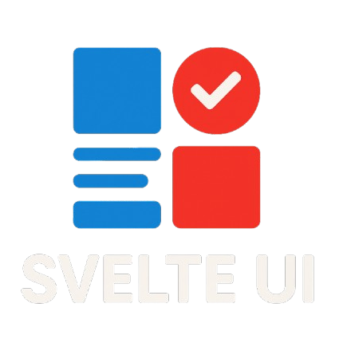

<p align="center">
  
</p>

<h3 align="center">The building blocks for davidnet's advanced UI.</h3>
<h4 align="center">
  <a href="https://design.davidnet.net">Design</a> ·
  <a href="https://github.com/davidnet-net/svelte-ui">GitHub</a> ·
  <a href="https://npmjs.com/@davidnet/svelte-ui">NPM</a> ·
  <a href="https://davidnet.net">Davidnet</a>
</h4>

<p align="center">
  View the docs at <a href="https://design.davidnet.net">Design</a>.
</p>

<br>
<br>

> [!IMPORTANT]
> The design website is the location for assets!
> View at <a href="https://github.com/davidnet-net/design/tree/main/static/Assets">Static Repo</a>

> [!CAUTION]
> svelte-ui is in BETA and iterating fast.
> Please use exact version numbers to avoid breaking changes.

<h3>Local Testing</h3>

Prepare svelte-ui

```bash
npm install
```

**For each iteration do**

```bash
npm run update
```

<h4>Linking the local version</h4>

In svelte-ui do.

```bash
npm link
```

Then do in the other project.

```bash
npm link @davidnet/svelte-ui
```

```bash
npm install
```

<h4>Unlinking the local version</h4>

Do in svelte-ui

```bash
npm unlink
```

Do in the other project

```bash
npm unlink @davidnet/svelte-ui
```

```bash
npm install
```

<h3>To release</h3>

<h4>Patch</h4>

```bash
npm run release-patch
```

<h4>Minor</h4>

```bash
npm run release-minor
```

<h4>Major</h4>

```bash
npm run release-major
```

<h4>Legacy</h4>

Without pushing & versioning

```bash
npm run release-legacy
```

<br>

<p align="center">
  Release schedule that is planned after beta.<br><br>
  MAJOR<b>.</b>MINOR<b>.</b>PATCH
  <table>
    <thead>
      <tr>
        <th>Version Type</th>
        <th>Changes</th>
      </tr>
    </thead>
    <tbody>
      <tr>
        <td><strong>PATCH</strong></td>
        <td>Bug fixes only</td>
      </tr>
      <tr>
        <td><strong>MINOR</strong></td>
        <td>Added features</td>
      </tr>
      <tr>
        <td><strong>MAJOR</strong></td>
        <td>Breaking changes</td>
      </tr>
    </tbody>
  </table>
  Add an <b>^</b> in your version in package.json to allow PATCHES and MINORS.
</p>
<br>
<br>
