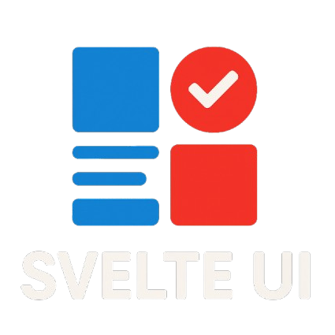

  

<h3 align="center">The building bricks for davidnet's advanced UI.</h3>
<h4 align="center">
  <a href="https://design.davidnet.net">Design</a> ·
  <a href="https://github.com/your-repo">GitHub</a> ·
  <a href="https://npmjs.com/@davidnet/svelte-ui">NPM</a> ·
  <a href="https://davidnet.net">Davidnet</a>
</h4>

  View the design rules. On   <a href="https://design.davidnet.net">Design</a>

 
 

> [!CAUTION]
> svelte-ui is iterating fast.
> Please use exact version numbers to avoid breaking changes.

> [!NOTE]
> The design website is also the CDN for assets
.
>View at <a href="https://github.com/davidnet-net/design/tree/main/static/Assets">Static Repo</a>